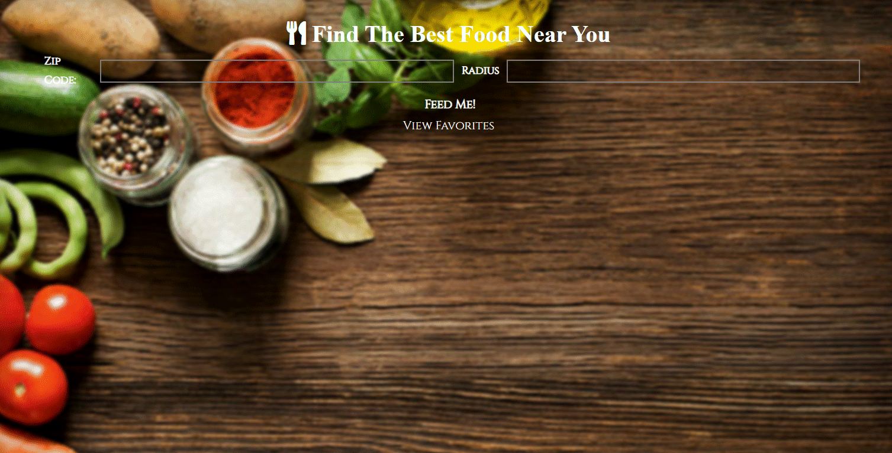
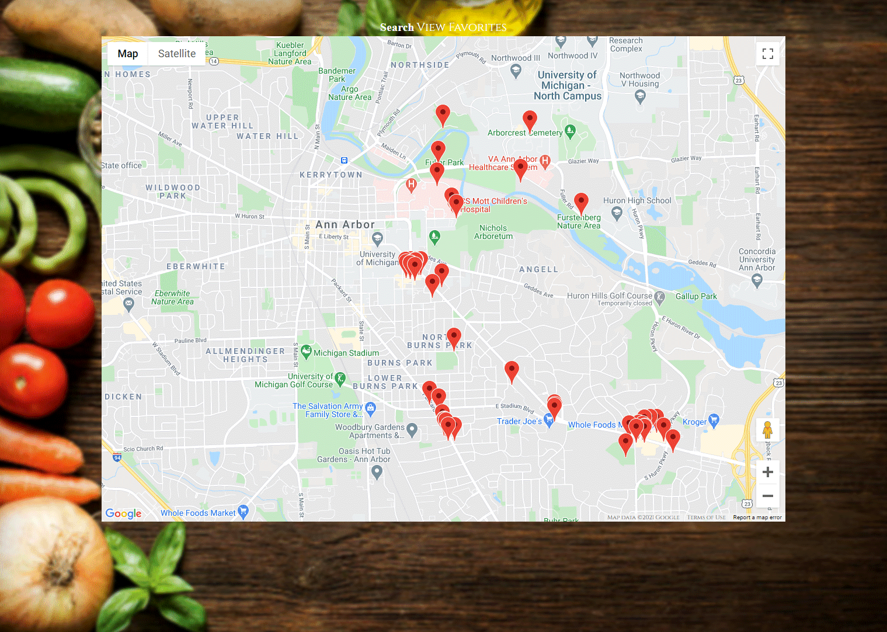

#Restaurant Dashboard 

##Developers: 
* **Teangelo Burks**
* **Jody Brzovski**
* **Cheyenne Nickelberry**


## User Story

```
AS often as I get hungry
I WANT to find restaurants near me 
SO THAT I can decide where I want to eat
```

## Acceptance Criteria

```
GIVEN a restaurant dashboard with form inputs
WHEN I search for a zip code and radius
THEN I am presented with a list of restaurants within that radius
WHEN I view a restaurant of interest
THEN I am presented with the restaurant name, ability to save a favorite, phone, rating, price point and google map of the location.
WHEN I click the restaurant name or image.
THEN I am presented with the yelp page for that restaurant.
WHEN I click view map.
THEN I am presented with google map for all restaurant locations in my search.
WHEN I click favorites.
THEN I am presented with a list of favorites from local storage.
```

#What exactly will the user experience look like?

**The user will enter a zip code & radius**


**Next the user then will be presented with the restaurant name, ability to save a favorite, phone number, rating, price point and google map of the location.**


**The user will have the option to view all the restaurants at once with a map view**


**Next the user will have the option to save restaurants in a favorites list by selecting the heart icon above the food options then view them on a seperate page.**


## Challenges:

* Working with Foundation CSS Framework for the first time.

* Learning to use Git in a group setting. 

## Take Away:

* Learned the importance of how Git should be used when working with group projects.

## Future Plans:

* Use more styling techniques on UI & Search Results page.

* 

**Technologies used:**
* HTML
* CSS
* JavaScript
* jQuery
* Foundation
* Yelp API
* Google Maps API


Deployed URL: [Restaurant Dashboard]()

>Looking for foooood?!!
